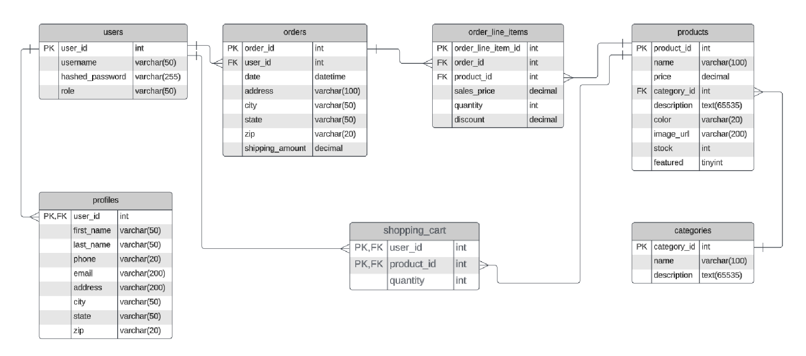

# EasyShop API

EasyShop is a RESTful API designed to handle user authentication, profile management, and e-commerce features like product browsing, category management, cart operations, and order processing. It uses Spring Boot and integrates modern technologies such as JWT, and OAuth2 for GitHub authentication.

[Link to GitHub Project](#)

---

## Table of Contents

- [Requirements](#requirements)
- [Technology Stack](#tech-stack)
- [Setup](#setup)
- [How It Works](#how-it-works)
- [Features](#features)
- [API Endpoints](#api-endpoints)
- [UML Diagram](#uml-diagram)

---

## Requirements

- [Git](https://git-scm.com/downloads)
- [Java 21](https://www.oracle.com/th/java/technologies/downloads/) or Higher
- [MySQL](https://www.mysql.com/) 8.0 or higher
- [Maven](https://maven.apache.org/) for dependency management
- [IntelliJ IDEA](https://www.jetbrains.com/idea/download/)
- [Spring Boot](https://spring.io/projects/spring-boot) 2.7.3
- [Postman](https://www.postman.com/downloads/) for testing

---

## Tech Stack

- Spring Boot
- Spring Security
- Spring Validation
- JWT
- OAuth2 Client
- Lombok

---

## Setup

1. Clone the repository:
   ```bash
   git clone https://github.com/joe-bor/easyShop.git
   cd easyShop
   ```
   
2. Update `application.properties` in `/backend/src/main/resources/`
   ```ini
   # Server configuration
   server.port=8080
   
   # Database config
   datasource.url=${datasource.url}
   datasource.username=${datasource.username}
   datasource.password=${datasource.password}
      
   # JWT configuration
   jwt.token-timeout-seconds=108000
   jwt.secret=${jwt.secret}
   
   # Github OAuth
   spring.security.oauth2.client.registration.github.client-id=${client_id}
   spring.security.oauth2.client.registration.github.client-secret=${client_secret}
   spring.security.oauth2.client.registration.github.redirect-uri=http://localhost:8080/login/oauth2/code/github
   spring.security.oauth2.client.registration.github.scope=user:email
   spring.security.oauth2.client.provider.github.authorization-uri=https://github.com/login/oauth/authorize
   spring.security.oauth2.client.provider.github.token-uri=https://github.com/login/oauth/access_token
   spring.security.oauth2.client.provider.github.user-info-uri=https://api.github.com/user
   spring.security.oauth2.client.provider.github.user-name-attribute=id
   
   
   # Email Service
   spring.mail.properties[mail.smtp.connectiontimeout]=5000
   spring.mail.properties[mail.smtp.timeout]=3000
   spring.mail.properties[mail.smtp.writetimeout]=5000
   spring.mail.host=smtp.outlook.com
   spring.mail.port=587
   spring.mail.username=${email_username}
   spring.mail.password=${email_password}
   spring.mail.properties.mail.smtp.auth=true
   spring.mail.properties.mail.smtp.starttls.enable=true   
   ```
   
3. Run `create_database.sql`, located in `/backend/database/`, to create and seed the database.

4. Run the application

---

## How It Works

[//]: # (![]&#40;&#41;)

- **Authentication**: Supports JWT-based authentication to protect resources and GitHub OAuth2 for login.
- **E-commerce Frontend**: Implements features like product browsing, adding products to cart, creating user profiles, and checkout.

---

## Features
- User Authentication
  - Register and login using username/password or GitHub Oauth2.
  - Secure endpoints with JWT.
- Profile Management
  - Retrieve and update user profiles.
  - Automatically populated with GitHub login.
- Cart Management
  - Add, remove, and view items in the cart.
- Order processing
  - Create and retrieve orders.
- Email Service
  - Send invoice via email upon successful checkout.
- Admin controls
  - Manage resources with role-based access control.

---

## UML Diagram


---

## API Endpoints

[//]: # (Auth)
<details>
  <summary><strong>Authentication</strong></summary>
     <ul>
         <li><code>POST /register</code>: Register a new user.</li>
         <li><code>POST /login</code>: Authenticate and retrieve JWT.</li>
         <li><code>GET /oauth2/success</code>: GitHub OAuth2 success endpoint.</li>
     </ul>
 </details>

[//]: # (Profile)
 <details>
    <summary><strong>Profile</strong></summary>
    <ul>
        <li><code>GET /profile</code>: Retrieve the authenticated user's profile.</li>
        <li><code>PUT /profile</code>: Update the authenticated user's profile.</li>
    </ul>
</details>

[//]: # (Products)
<details>
     <summary><strong>Products</strong></summary>
     <ul>
         <li><code>GET /products</code>: List all products.</li>
         <li><code>GET /products/{product_id}</code>: Get product by id.</li>
         <li><code>POST /products/</code>: Create a product.</li>
         <li><code>PUT /products/{product_id}</code>: Update a product.</li>
         <li><code>DELETE /products/{product_id}</code>: Delete a product.</li>
         <li><code>GET products?cat=1&minPrice=499&maxPrice=700</code>: List filtered products.</li>
         <ul>
            <li>cat: categories</li>
            <li>minPrice: minimum price</li>
            <li>maxPrice: maximum price</li>
         </ul>
     </ul>
 </details>

[//]: # (Categories)
 <details>
     <summary><strong>Categories</strong></summary>
     <ul>
         <li><code>GET /categories</code>: List all categories.</li>
         <li><code>POST /categories</code>: Add a new category.</li>
         <li><code>DELETE /categories/{id}</code>: Delete a category.</li>
     </ul>
 </details>

[//]: # (Cart)
 <details>
     <summary><strong>Cart</strong></summary>
     <ul>
         <li><code>GET /cart</code>: View the current user's cart.</li>
         <li><code>POST /cart/products/{productId}</code>: Add a product to the cart.</li>
         <li><code>DELETE /cart</code>: Clear the cart.</li>
     </ul>
 </details>

[//]: # (Orders)
 <details>
     <summary><strong>Orders</strong></summary>
     <ul>
         <li><code>POST /orders</code>: Checkout current shopping cart.</li>
     </ul>
 </details>

---